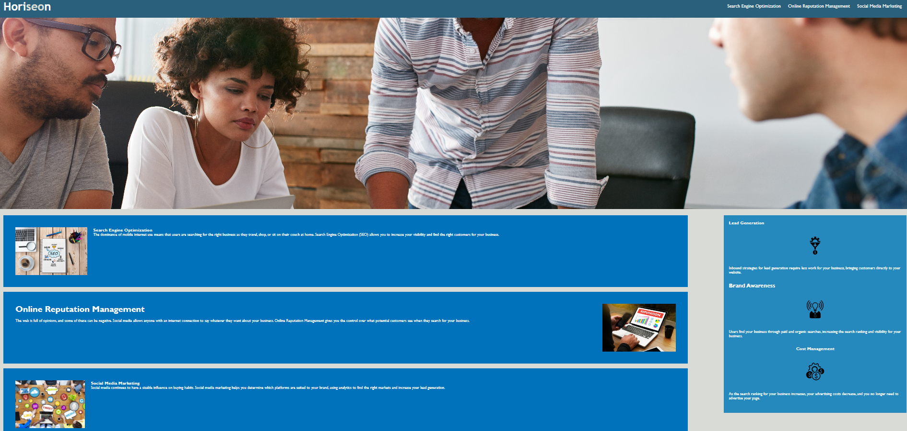

Homework Assignment Week 1 has been completed.
I have used the started code for this week's assigment.
In the code, I have added the HTML semantics.
These changes will optimize web application's appearance and functionality.
Serach engine optimization were applied in the code. 
I have added comments in the CSS file to give reviewers what each selectors and properties does.
Please use this link to view the page https://minikozort.github.io/Homework-W1/

